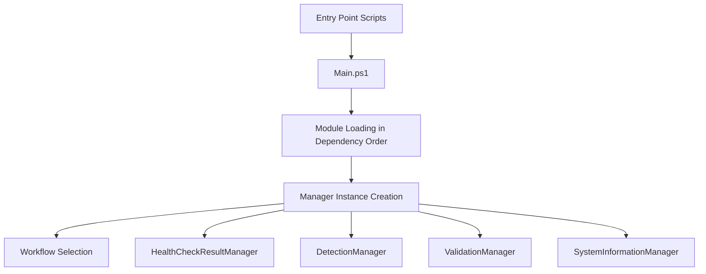
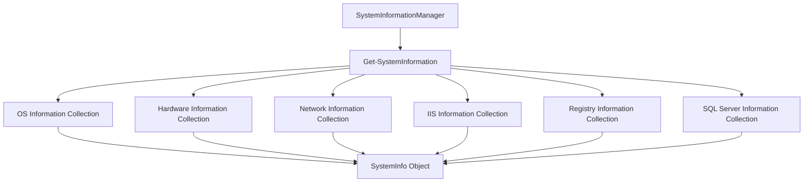
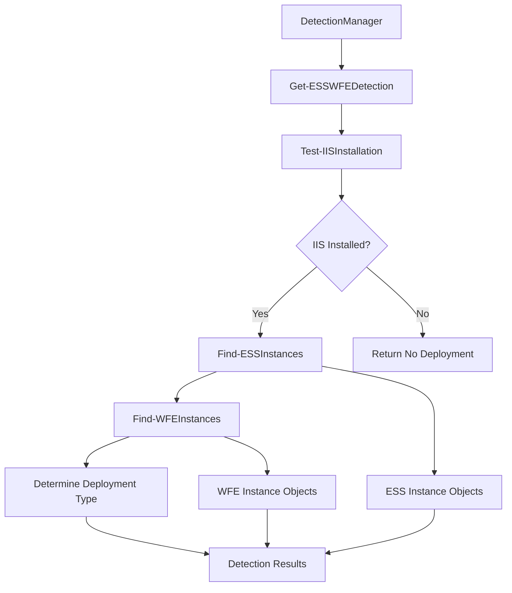
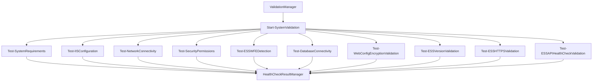
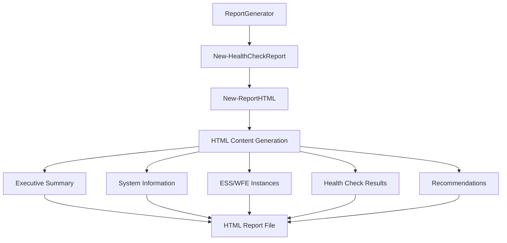

# ESS Pre-Upgrade Health Checker - Design and Data Flow Documentation

## 🏗️ Architecture Overview

The ESS Pre-Upgrade Health Checker follows **Call Stack Principles** with a clean, modular architecture that eliminates global variables and uses pure dependency injection. The system is designed around a **3-phase approach** with clear separation of concerns.

### 🎯 Core Design Principles

1. **Zero Global Variables**: All global state has been eliminated in favor of explicit parameter passing
2. **Dependency Injection**: Manager instances are created at the top level and passed through the call stack
3. **Single Responsibility**: Each module has one clear purpose and focused functionality
4. **Separation of Concerns**: Discovery, information collection, and validation are distinct phases
5. **Testability**: Functions can be tested in isolation without hidden dependencies

## 📊 System Architecture

```
┌─────────────────────────────────────────────────────────────────┐
│                    Entry Points                                 │
├─────────────────────────────────────────────────────────────────┤
│  RunHealthCheck.ps1          RunInteractiveHealthCheck.ps1     │
│  (Automated Mode)            (Interactive Mode)                │
└─────────────────────┬───────────────────────────────────────────┘
                      │
                      ▼
┌─────────────────────────────────────────────────────────────────┐
│                    Main Orchestration                          │
├─────────────────────────────────────────────────────────────────┤
│  Main.ps1                                                      │
│  • Module Loading (Dependency Order)                          │
│  • Manager Instance Creation                                  │
│  • Workflow Orchestration                                     │
└─────────────────────┬───────────────────────────────────────────┘
                      │
                      ▼
┌─────────────────────────────────────────────────────────────────┐
│                    Manager Classes                             │
├─────────────────────────────────────────────────────────────────┤
│  HealthCheckResultManager    DetectionManager                  │
│  ValidationManager           SystemInformationManager          │
└─────────────────────┬───────────────────────────────────────────┘
                      │
                      ▼
┌─────────────────────────────────────────────────────────────────┐
│                    Three-Phase Architecture                    │
├─────────────────────────────────────────────────────────────────┤
│  Phase 1: Discovery        Phase 2: Information               │
│  ┌─────────────────┐       ┌─────────────────┐                │
│  │ Detection/      │       │ SystemInfo/     │                │
│  │ • ESSDetection  │       │ • OSInfo        │                │
│  │ • WFEDetection  │       │ • HardwareInfo  │                │
│  │ • API Health    │       │ • IISInfo       │                │
│  │ • Orchestrator  │       │ • SQLInfo       │                │
│  └─────────────────┘       └─────────────────┘                │
│                                                               │
│  Phase 3: Validation                                          │
│  ┌─────────────────┐                                          │
│  │ Validation/     │                                          │
│  │ • SystemReqs    │                                          │
│  │ • Infrastructure│                                          │
│  │ • ESSValidation │                                          │
│  │ • Orchestrator  │                                          │
│  └─────────────────┘                                          │
└─────────────────────┬───────────────────────────────────────────┘
                      │
                      ▼
┌─────────────────────────────────────────────────────────────────┐
│                    Core Services                               │
├─────────────────────────────────────────────────────────────────┤
│  Config.ps1          HealthCheckCore.ps1    ReportGenerator.ps1│
│  • Configuration     • Result Management    • HTML Reports     │
│  • Requirements      • Status Tracking      • Styling          │
│  • Settings          • Summary Statistics   • Data Formatting  │
└─────────────────────┬───────────────────────────────────────────┘
                      │
                      ▼
┌─────────────────────────────────────────────────────────────────┐
│                    Utilities & Helpers                        │
├─────────────────────────────────────────────────────────────────┤
│  HelperFunctions.ps1    InteractiveHealthCheck.ps1            │
│  • Common Utilities    • User Interaction                     │
│  • Formatting          • Instance Selection                   │
│  • IIS Helpers         • Custom URL Input                     │
└─────────────────────────────────────────────────────────────────┘
```

## 🔄 Data Flow Architecture

### 1. **Initialization Phase**



**Key Components:**
- **Entry Points**: `RunHealthCheck.ps1` (automated) and `RunInteractiveHealthCheck.ps1` (interactive)
- **Main Orchestrator**: `Main.ps1` loads modules in dependency order and creates manager instances
- **Manager Classes**: Four specialized managers handle different aspects of the health check

### 2. **System Information Collection Phase**



**Data Structure:**
```powershell
$SystemInfo = @{
    ComputerName = "SERVER-NAME"
    Domain = "DOMAIN"
    UserName = "USER"
    IsElevated = $true
    OS = @{ Caption = "Windows Server 2019"; Version = "10.0.17763"; ... }
    Hardware = @{ TotalPhysicalMemory = 32; TotalCores = 8; ... }
    Network = @{ Adapters = @(); ... }
    IIS = @{ IsInstalled = $true; Sites = @(); ApplicationPools = @(); ... }
    Registry = @{ DotNetVersions = @("4.8"); ... }
    SQLServer = @{ IsInstalled = $true; Instances = @(); ... }
    CollectedAt = Get-Date
}
```

### 3. **Discovery Phase**



**ESS Instance Structure:**
```powershell
$ESSInstance = @{
    SiteName = "Default Web Site"
    ApplicationPath = "/Self-Service/ESS"
    PhysicalPath = "C:\inetpub\wwwroot\Self-Service\ESS"
    ApplicationPool = "ESS_AppPool"
    DatabaseServer = "SQLSERVER\INSTANCE"
    DatabaseName = "PayGlobalDB"
    TenantID = "ba81e050-..."
    AuthenticationMode = "PayGlobal"
    WebConfigEncrypted = $true
    ESSVersion = "5.5.1.2"
    PayGlobalVersion = "4.66.0.0"
}
```

**WFE Instance Structure:**
```powershell
$WFEInstance = @{
    SiteName = "Default Web Site"
    ApplicationPath = "/Self-Service/WorkflowEngine"
    PhysicalPath = "C:\inetpub\wwwroot\Self-Service\WorkflowEngine"
    ApplicationPool = "WFE_AppPool"
    DatabaseServer = "SQLSERVER\INSTANCE"
    DatabaseName = "PayGlobalDB"
    TenantID = "ba81e050-..."
    ClientURL = "https://ess.company.com"
    WFEVersion = "5.5.1.2"
}
```

### 4. **Validation Phase**



**Health Check Result Structure:**
```powershell
$HealthCheckResult = @{
    Category = "System Requirements"
    Check = "Memory"
    Status = "PASS"  # PASS, FAIL, WARNING, INFO
    Message = "Sufficient memory available (32 GB)"
    Timestamp = Get-Date
}
```

### 5. **Report Generation Phase**



## 🔧 Manager Classes Design

### 1. **HealthCheckResultManager**
- **Purpose**: Centralized result management and status tracking
- **Key Methods**:
  - `AddResult(Category, Check, Status, Message)`: Adds health check results
  - `GetResults()`: Returns all results
  - `GetSummary()`: Returns statistics (Total, Pass, Fail, Warning, Info)
  - `GetResultsByCategory(Category)`: Filters results by category
  - `GetResultsByStatus(Status)`: Filters results by status

### 2. **DetectionManager**
- **Purpose**: Coordinates ESS/WFE detection and deployment type determination
- **Key Methods**:
  - `DetectESSWFEDeployment(SystemInfo, Manager)`: Main detection workflow
  - Handles IIS installation check, ESS detection, WFE detection, and deployment type determination

### 3. **ValidationManager**
- **Purpose**: Orchestrates all validation checks
- **Key Methods**:
  - `RunSystemValidation(SystemInfo, DetectionResults, Manager, Configuration)`: Main validation workflow
  - Coordinates system requirements, infrastructure, and ESS-specific validations

### 4. **SystemInformationManager**
- **Purpose**: Manages system information collection and retrieval
- **Key Methods**:
  - `CollectSystemInformation()`: Gathers all system information
  - `GetSystemInfoValue(Path)`: Retrieves specific system information values
  - `UpdateDeploymentInformation(DetectionResults)`: Updates system info with deployment details

## 📋 Module Dependencies

### **Dependency Loading Order** (from Main.ps1):
1. **Core Modules** (Foundation):
   - `HealthCheckCore.ps1` - Result management
   - `Config.ps1` - Configuration management

2. **Utility Modules**:
   - `HelperFunctions.ps1` - Common utilities

3. **System Information Modules** (depends on Core):
   - `OSInfo.ps1` - Operating system information
   - `HardwareInfo.ps1` - Hardware information
   - `IISInfo.ps1` - IIS configuration
   - `SQLInfo.ps1` - SQL Server information
   - `SystemInfoOrchestrator.ps1` - System info coordination

4. **Validation Modules** (depends on SystemInfo):
   - `SystemRequirements.ps1` - System requirement validation
   - `InfrastructureValidation.ps1` - Infrastructure validation
   - `ESSValidation.ps1` - ESS-specific validation
   - `ValidationOrchestrator.ps1` - Validation coordination

5. **Detection Modules** (depends on SystemInfo):
   - `ESSDetection.ps1` - ESS installation detection
   - `WFEDetection.ps1` - WFE installation detection
   - `DetectionOrchestrator.ps1` - Detection coordination

6. **Report Generation** (depends on all other modules):
   - `ReportGenerator.ps1` - HTML report generation

7. **Interactive Functionality** (depends on all other modules):
   - `InteractiveHealthCheck.ps1` - Interactive health check functionality

## 🔄 Call Stack Flow

### **Automated Mode Flow:**
```
RunHealthCheck.ps1
    ↓
Main.ps1 (Module Loading)
    ↓
Start-ESSHealthChecks()
    ↓
Manager Instance Creation
    ↓
Get-SystemInformation(SystemInfoManager)
    ↓
Get-ESSWFEDetection(SystemInfo, HealthCheckManager, DetectionManager)
    ↓
Start-SystemValidation(SystemInfo, DetectionResults, HealthCheckManager, ValidationManager)
    ↓
New-HealthCheckReport(Results, SystemInfo, DetectionResults, HealthCheckManager)
```

### **Interactive Mode Flow:**
```
RunInteractiveHealthCheck.ps1
    ↓
Main.ps1 (Module Loading)
    ↓
Start-InteractiveESSHealthChecks()
    ↓
Manager Instance Creation
    ↓
Get-SystemInformation(SystemInfoManager)
    ↓
Get-ESSWFEDetection(SystemInfo, HealthCheckManager, DetectionManager)
    ↓
Show-InstanceSelectionMenu(DetectionResults)
    ↓
Get-ESSURLInput(SelectedInstances)
    ↓
Start-SelectiveSystemValidation(SystemInfo, SelectedInstances, OriginalDetectionResults, ESSUrl, HealthCheckManager, ValidationManager)
    ↓
New-TargetedHealthCheckReport(Results, SystemInfo, SelectedInstances, OriginalDetectionResults, ESSUrl, HealthCheckManager)
```

## 🎯 Key Design Patterns

### 1. **Dependency Injection Pattern**
- All manager instances are created at the top level
- Dependencies are passed explicitly through function parameters
- No global state or hidden dependencies

### 2. **Orchestrator Pattern**
- Each phase has an orchestrator that coordinates related modules
- Orchestrators handle the workflow and delegate specific tasks to specialized modules

### 3. **Manager Pattern**
- Manager classes encapsulate related functionality
- Provide a clean interface for operations
- Maintain internal state without global variables

### 4. **Factory Pattern**
- Configuration objects are created using factory functions
- System information is collected using specialized factory methods

### 5. **Strategy Pattern**
- Different validation strategies are implemented as separate modules
- Validation orchestrator selects appropriate strategies based on context

## 📊 Data Structures

### **Configuration Object:**
```powershell
$Configuration = @{
    SystemInfo = @{}
    DetectionResults = @{}
    MinimumRequirements = @{
        MinimumDiskSpaceGB = 10
        MinimumMemoryGB = 32
        MinimumCores = 4
        MinimumProcessorSpeedGHz = 2.0
        RequiredOSVersions = @("Windows Server 2016", "Windows Server 2019", "Windows Server 2022")
        RequiredDotNetVersion = "4.8"
        RequiredIISVersion = "7.5"
        MinimumESSVersion = "5.4.7.2"
    }
    ESSVersionCompatibility = @{
        "5.5.1.2" = @{
            MinimumPayGlobalVersion = "4.66.0.0"
            Description = "ESS 5.5.1.2 requires PayGlobal 4.66.0.0 or higher"
        }
    }
    APIHealthCheck = @{
        DefaultTimeoutSeconds = 90
        MaxRetries = 2
        RetryDelaySeconds = 5
        ConnectionTimeoutSeconds = 30
        ReadWriteTimeoutSeconds = 60
    }
    Performance = @{
        EnableRetryLogic = $true
        EnableConnectionPooling = $true
        MaxConcurrentRequests = 3
        RequestDelaySeconds = 1
    }
}
```

### **Detection Results Object:**
```powershell
$DetectionResults = @{
    IISInstalled = $true
    ESSInstances = @($ESSInstance1, $ESSInstance2, ...)
    WFEInstances = @($WFEInstance1, $WFEInstance2, ...)
    DeploymentType = "Combined"  # Combined, ESS Only, WFE Only, None
    Summary = @("Found 3 ESS installation(s)", "Found 3 WFE installation(s)", ...)
    # For interactive reports:
    IsInteractiveReport = $true
    OriginalESSInstances = @(...)  # All ESS instances (for status display)
    OriginalWFEInstances = @(...)  # All WFE instances (for status display)
}
```

## 🔍 Error Handling Strategy

### **Error Handling Patterns:**
1. **Try-Catch Blocks**: Used throughout for graceful error handling
2. **Parameter Validation**: All functions validate required parameters
3. **Graceful Degradation**: System continues operation when non-critical components fail
4. **Detailed Error Messages**: Errors include context and suggested actions
5. **Logging**: Verbose logging for debugging and troubleshooting

### **Error Recovery:**
- Failed health checks are recorded as FAIL status
- System information collection continues even if some components fail
- API health checks include retry logic with exponential backoff
- Report generation handles missing data gracefully

## 🧪 Testing Strategy

### **Testability Features:**
1. **Isolated Functions**: Each function can be tested independently
2. **Mock Support**: Manager instances can be mocked for testing
3. **Parameter Injection**: All dependencies are injected, making testing easier
4. **No Global State**: Tests don't interfere with each other
5. **Clear Interfaces**: Functions have well-defined input/output contracts

### **Test Structure:**
- `src/tests/SimpleTest.ps1` - Basic functionality testing
- Individual module testing with mock managers
- Integration testing with real system information
- End-to-end testing of complete workflows

## 📈 Performance Considerations

### **Performance Optimizations:**
1. **Parallel Processing**: System information collection can be parallelized
2. **Caching**: System information is collected once and reused
3. **Lazy Loading**: Modules are loaded only when needed
4. **Efficient Data Structures**: Uses hashtables and arrays for fast access
5. **Connection Pooling**: Database connections are pooled when possible

### **Resource Management:**
- Manager instances are created once and reused
- Large data structures are passed by reference
- Memory usage is optimized through efficient data structures
- Network connections are properly closed after use

## 🔒 Security Considerations

### **Security Features:**
1. **Elevated Privilege Detection**: Checks if running with administrator privileges
2. **Secure Configuration**: Sensitive configuration data is handled securely
3. **Input Validation**: All user inputs are validated and sanitized
4. **Error Information**: Error messages don't expose sensitive system information
5. **Access Control**: Respects system-level access controls

### **Data Protection:**
- Database connection strings are handled securely
- Tenant IDs are truncated in reports for privacy
- Sensitive configuration data is not logged in plain text
- User credentials are not stored or transmitted

## 📝 Maintenance and Extensibility

### **Extensibility Features:**
1. **Modular Design**: New modules can be added easily
2. **Plugin Architecture**: New validation checks can be added as separate modules
3. **Configuration-Driven**: Behavior can be modified through configuration
4. **Clear Interfaces**: Well-defined interfaces make extension straightforward
5. **Documentation**: Comprehensive documentation for all components

### **Maintenance Benefits:**
- Clear separation of concerns makes debugging easier
- Single responsibility principle reduces complexity
- Dependency injection makes testing and maintenance simpler
- Consistent patterns throughout the codebase
- Comprehensive error handling and logging

---

**Version**: 2.4 - Enhanced Interactive Health Checker with Smart Validation  
**Last Updated**: September 2025  
**Author**: Zoe Lai

This documentation provides a comprehensive overview of the ESS Pre-Upgrade Health Checker's design, architecture, and data flow. The system follows modern software engineering principles with clean separation of concerns, dependency injection, and maintainable code structure.
